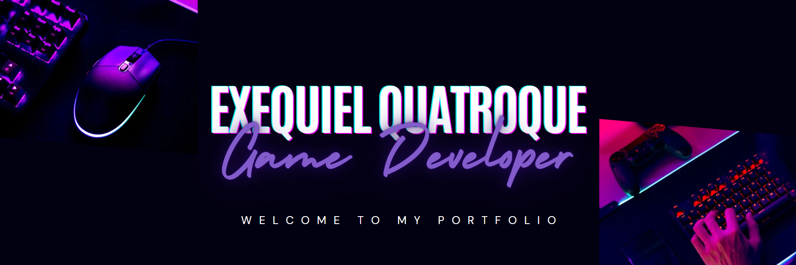
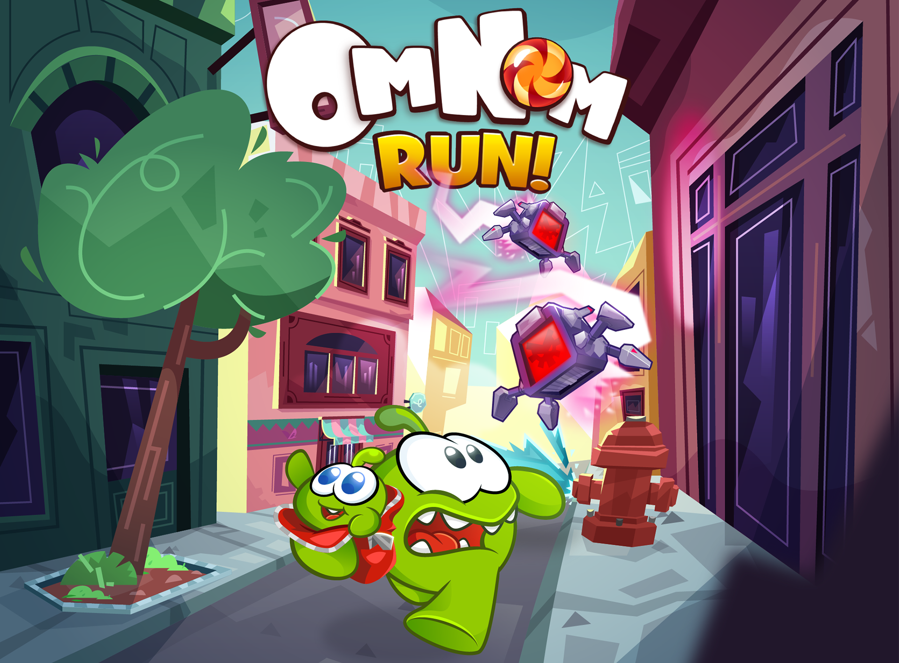
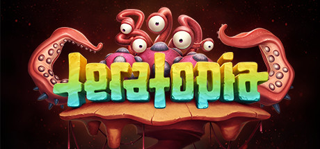
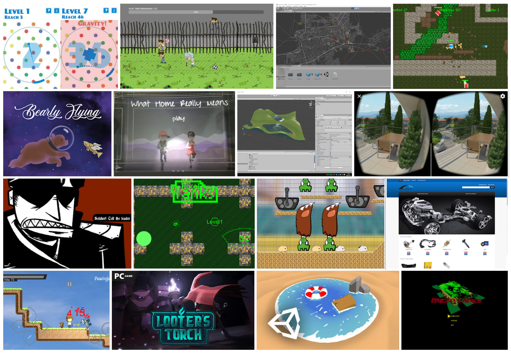

<h1 align="center">Hello I'm</h1>

<!--
**soumyajit4419/soumyajit4419** is a ✨ _special_ ✨ repository because its `README.md` (this file) appears on your GitHub profile.
Here are some ideas to get you started: -->

  
  

  

## 👨🏻‍💻 About Me:

- 🙋‍♂️ All about me is at **[My Linkedin](https://www.linkedin.com/in/exequielquatroque/)**

- 🕹️ I’m currently working at [`Bigfoot Gaming`](http://bigfootgaming.net/).

- 🌱 I’m currently learning `Shaders stuff`

- 👯 I’m looking to collaborate for `anything FUN!`

- 🤔 I’m looking for help with `Test driven development`

- 💬 Ask me about anything, Except `Backend stuff` :sweat_smile:

- 👨‍💻 Life Hack: `First, make sure you enjoy what you do. Otherwise, you'll be working to pay the doctor's bill.`

- ⚡ Fun fact: `Two hours of mindless debugging can save you up to five minutes reading documentation! 👍 (just read the docs)`

## Cool games I worked on
<table>
<tr>

<td width="50%">
<h3 align="center">Om Nom Run 3</h3>

 

For this project I was in charge of coming up with the project architecture and tackling all the gameplay related problems. I think I really shined with this one.

</td>
  
<td width="50%">
<h3 align="center">Temple Run - Idle Explorers</h3>

 

I developed mostly every gameplay mechanic, every vfx and shader and also part of the UI!

</td>                                                                               

</tr>

<tr>

<td width="50%">
<h3 align="center">Teratopia</h3>

                                       

 

We developed this game with a small team and I worked on every part of the game including AI and editor tools. Also I participated in its porting to XBOX One consoles.

    
</td>
  
<td width="50%">
<h3 align="center">Other Cool projects and Jams</h3>

<a href="http://exe4que.blogspot.com/" target="_blank">Other Cool projects and Jams"></a>
 

I love participating in game jams and embarking in exiting personal projects and experiments. Also, I often work for other clients on my own.

</td>

</tr>

</table>

## 🛠️ Technologies and Tools I use:

## ❤️ Let's get connected:

 

## 📊 My GitHub Data:

